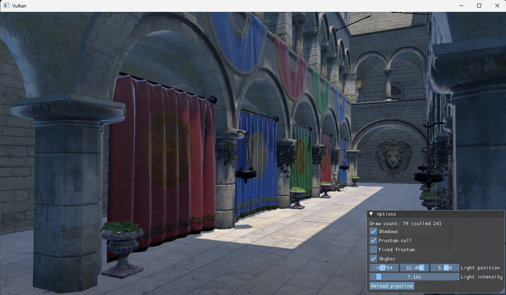

# Flare

## About
A GPU-Driven renderer. It's a playground for me to experiment with and implement modern graphics programming techniques.

### Screenshots

## Features
- [x] Fully bindless resources
- [x] glTF scene loading
- [x] Physically-based rendering
- [x] Shadow mapping
- [x] Compute frustum culling
- [x] Image based lighting

## Todos
- [ ] Raytracing
- [ ] Deferred rendering pipeline