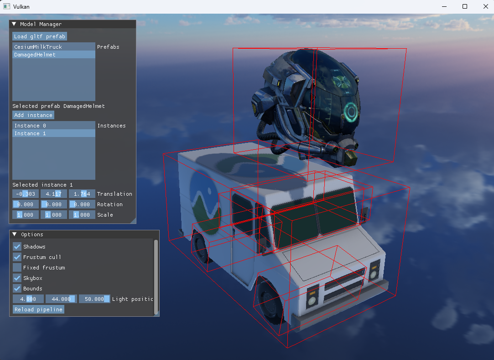

# Flare

## About
A GPU-Driven renderer. It's a playground for me to experiment with and implement modern graphics programming techniques.

### Screenshots


## Features
- [x] Fully bindless resources
- [x] glTF scene loading
- [x] Shader hot-reloading
- [x] Compute frustum culling
- [x] Shadow mapping
- [x] Deferred shading pipeline

## Todos
- [ ] SSR
- [ ] SSAO
- [ ] Post-processing effects
- [ ] Raytracing

## Build instructions
### Cloning
```
git clone https://github.com/tufourn/Flare.git
```

### Dependencies
- Vulkan SDK

### Building
The project is built using CMake. Use the provided CMakeLists.txt to generate a build configuration.

The code was tested on the following GPUs on Windows:
- Nvidia 3060 mobile
- AMD RX 580

## References
[Vulkan Tutorial](https://vulkan-tutorial.com/)

[Vulkan Guide](https://vkguide.dev/)

[LearnOpenGL](https://learnopengl.com/)

[Sascha Willem's Vulkan Samples](https://github.com/SaschaWillems/Vulkan)

[Mastering Graphics Programming with Vulkan](https://github.com/PacktPublishing/Mastering-Graphics-Programming-with-Vulkan)

[The Modern Vulkan Cookbook](https://github.com/PacktPublishing/The-Modern-Vulkan-Cookbook)
